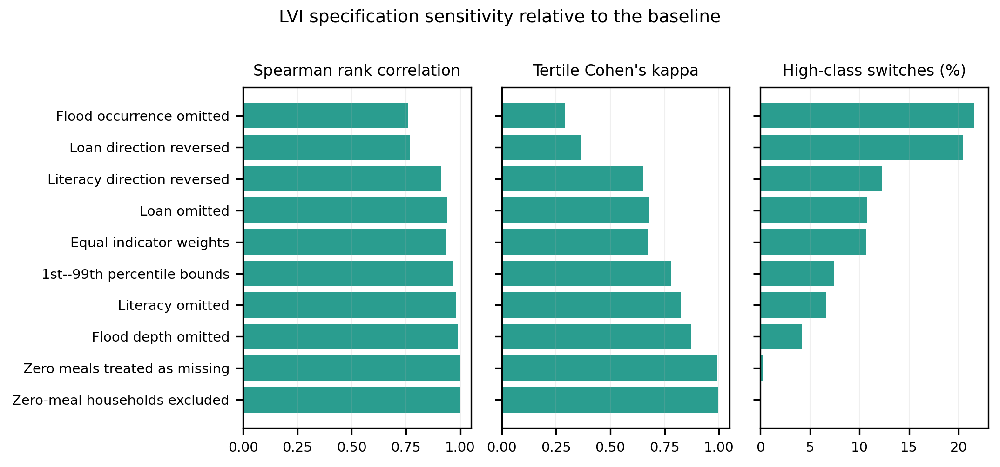
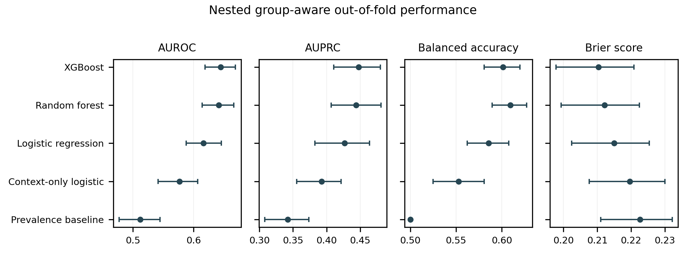

# Auditing Leakage in Composite-Index Classification: A Bangladesh Household Survey Case Study

This reading draft mirrors the authoritative `paper/main.tex` manuscript. The LaTeX file controls submission content.

## Abstract

When targets are constructed from survey indicators, supplying their ingredients to a classifier creates circular discrimination. We audit this failure mode in 5,605 cleaned Bangladesh household records. A fixed-label diagnostic raises climate-profile-blocked logistic AUROC from 0.6085 to 0.9997 when target ingredients are added. Nested evaluation with non-overlapping predictors yields XGBoost AUROC 0.6443 and Brier score 0.2103 versus 0.2226 for a prevalence baseline. Across 11 index specifications, 705 records are strictly High in all variants and 2,354 switch High status. A public-source linkage reveals that the cleaned household-ID column is misordered; a separately measured welfare aggregate is linked only after 14 exact row checks. Robust-High households have lower median per-capita expenditure than never-High households. In 64-district holdout, adding LVI to demographics changes log-expenditure MAE from 0.3578 to 0.3542, with a district-bootstrap interval for the incremental improvement including zero. These results support a bounded methods and contemporaneous welfare-association case study, not future food-security prediction.

**Keywords—** composite index, target leakage, Bangladesh household survey, group-aware validation, vulnerability measurement

## I. Introduction

Food insecurity is multidimensional and difficult to reduce to a single observed outcome. Experience-based measurement instruments provide a principled way to quantify access-related food insecurity across settings [1]; studies in rural Bangladesh have also evaluated both the Food Insecurity Experience Scale and shorter experience-based tools [2], [3]. Vulnerability is related but distinct: it concerns susceptibility to harm and the capacity to respond [4]. The Livelihood Vulnerability Index (LVI) operationalizes this idea by combining indicators of exposure, sensitivity, and adaptive capacity [5], although later reviews emphasize that indicator selection, weighting, and aggregation remain consequential design choices [6].

Bangladesh research links weather variability, climatic extremes, salinity, and delta livelihoods with household welfare or food-consumption outcomes [7]–[10]. Those findings motivate careful household-level assessment. Machine learning can help organize food-security evidence [11], [12], provided targets, leakage, and data dependence are assessed explicitly.

The research question is: *How do target construction and dependence-aware validation change the interpretation of machine-learning performance for a sample-relative composite index?* We address it by tracing every target ingredient, contrasting circular and non-overlapping feature sets, blocking repeated climate context in validation, and testing the stability of index-defined classes. The contribution is an auditable failure-mode analysis and a reusable sequence of checks for studies that classify constructed survey indices. The Bangladesh sample is the worked case; exploratory clustering is retained only as a cautionary robustness check.

## II. Related Work

The foundational LVI framework aggregates normalized livelihood indicators while retaining the exposure–sensitivity–adaptive-capacity interpretation [5]. Its attraction is interpretability, but comparative evidence shows substantial heterogeneity in indicator construction and weighting [6]. This motivates reporting sensitivity to defensible coding alternatives rather than treating one specification as immutable.

Recent food-security research has used machine learning for prediction, targeting, and crisis analysis, while stressing transparency and usability [11], [12]. A Malawi study uses survey and contextual information with a temporal food-security outcome [13]. Here the outcome is a contemporaneous constructed index class.

Methodologically, principal component analysis (PCA) summarizes correlated features [14]; *k*-means and Ward clustering provide contrasting partitioning strategies [15], [16]. The supervised audit uses logistic regression, random forests, and extreme gradient boosting [17]–[19]. Nested validation limits tuning bias [20], and keeping related observations in the same fold addresses dependence that would otherwise inflate performance [21]. TreeSHAP was present in the audited workflow [22]; because that workflow’s target was circular, its rankings are treated as descriptive artifacts rather than confirmatory explanations.

## III. Data and Methodology

### A. Analytic Sample and Provenance Boundary

The cleaned analytic table, internally described as BIHS Round 3, contains 5,605 records; IFPRI reports 5,604 households [23]. A public reproducibility archive supplies Round 3 identification, weights, and a separate household-expenditure aggregate [24]. The received local `hhid2` column is misordered: none of its 5,605 values matches the official ID for its row. Reconciliation uses the officially weighted identification sample sorted by numeric `a01`: every local row agrees exactly across 13 Module A identification fields and household size from the expenditure file. We use this audited derived mapping only for welfare linkage; the original cleaned data and `hhid2` were not overwritten. The published 5,604-versus-5,605 count remains an unresolved source-definition discrepancy and provenance limitation. Official district and community codes are available, but verified PSU/stratum mappings, climate sources, and climate reference years are not. The 39 climate-profile groups used in the earlier classifier are reconstructed from observed climate fields, not administrative identifiers.

### B. Livelihood Vulnerability Index

For indicator *j* and household *i*, a forward-coded indicator is

\[
z_{ij}=\frac{x_{ij}-\min(x_j)}{\max(x_j)-\min(x_j)},
\]

whereas a protective indicator uses the reversed numerator. Each dimension is the mean of its normalized indicators, and the household LVI is the equal-weight mean of exposure \(E_i\), sensitivity \(S_i\), and adaptive-capacity vulnerability \(A_i\):

\[
\mathrm{LVI}_i=\frac{E_i+S_i+A_i}{3}.
\]

Observed full-sample tertiles define low, medium, and high descriptive classes. These cut points are sample relative, not policy thresholds. Exact reconstruction checks recovered the archived dimension and LVI values.

The Round-3 questionnaire reproduced with [2] codes Module B1 literacy as 1 for cannot read and write and 4 for can read and write; Module F02 codes a current loan as Yes=1 and No=2. The binary loan recode follows the recorded response coding, but loan presence alone cannot establish whether it represents credit access or debt burden. The upstream derivation of the cleaned `adult_literacy_rate` field from individual responses is unavailable. We therefore treat the inherited index coding as an audited baseline rather than an adjudicated measurement standard.

### C. Specification Consensus and Welfare Criterion

We define *strict robust High* as High under all 11 saved index specifications. A record omitted by the zero-meal-exclusion variant is not certified strict robust High. One-at-a-time switches against baseline identify which coding choice changes each record's status; correlated variants are not treated as independent causes. The public file's monthly per-capita household-expenditure aggregate serves as a contemporaneous criterion for association. Income and meal-related variables contribute to the LVI, creating conceptual overlap; this comparison cannot establish independent validity or causal predictive performance. After the audited `a01` linkage, 5,604 records have nonmissing expenditure. We compare robust-High and never-High expenditure descriptively, resampling whole official districts for uncertainty.

For geographic transfer, five-fold cross-validation holds out all households in each of 64 official district codes. On identical held-out records, fixed ridge models compare training-mean log expenditure, LVI alone, demographics (head age, sex, household size), demographics plus LVI, and demographics plus strict robust High. Training-only imputation and scaling precede fitting. We report pooled log-scale mean absolute error (MAE), R², and paired district-level MAE differences. The archived index and classifications retain full-sample scaling, so this is a transductive same-wave criterion test rather than a prospective forecast.

### D. Secondary Clustering Check

As a secondary check, 15 standardized indicators enter PCA (9 components, 81.1714% variance explained) and *k*-means. Bootstrap and alternative-geometry analyses test whether the partition is stable. Cluster labels do not define the supervised target.

### E. Leakage-Aware Classification

The original supervised target was a deterministic threshold of the full LVI, constructed from indicators also supplied as predictors. This is target leakage caused by feature–target construction overlap (target circularity), distinct from ordinary train/test contamination in which held-out information enters model fitting. Splitting the data does not remove this mathematical dependency. The original experiment measures the magnitude of circularity; the fixed-label diagnostic isolates the effect of supplying target ingredients. To assess residual predictive signal from climate, crop-context, and plot-level variables, the corrected nested experiment defines high socioeconomic vulnerability from the mean of sensitivity and adaptive-capacity vulnerability, excluding exposure from the target and all target-defining indicators from the predictors. This intentionally changes the task from reconstructing the full LVI formula to discriminating a constructed socioeconomic class; it does not provide an independent real-world food-security outcome. Target normalization and the upper-tertile cut are estimated separately in each outer training fold. The feature dictionary contains 22 recorded climate, crop-context, and plot-level variables: 16 context variables and 6 plot-level environmental variables. The pooled out-of-fold target has 1,875 high-class records. Logistic regression, random forest, and extreme gradient boosting are compared with a 16-variable context-only logistic regression and a prevalence baseline.

Nested group-aware validation uses five outer folds and keeps each of the 39 reconstructed climate-profile groups wholly within one fold. These are repeated climate profiles, not verified districts, spatial blocks, or survey primary sampling units. Tuning and preprocessing occur inside the training data. Normalization bounds and the upper-tertile target cutoff are re-estimated in each outer training fold (target-score cutoffs 0.493580–0.502184). Thus each held-out household is labeled using its fold's rule; pooled out-of-fold labels do not share one global cutoff. Predictions cover all 5,605 records exactly once per model. Reported metrics are receiver-operating-characteristic area (AUROC), precision–recall area (AUPRC), balanced accuracy, and Brier score, accompanied by 1,000-resample climate-profile-group bootstrap percentile intervals. These summarize performance against fold-specific constructed labels, not future outcomes.

## IV. Experimental Setup

The original audit follows three linked checks: (i) reconstruct the composite target and run a controlled leakage diagnostic; (ii) hold repeated climate profiles together during nested evaluation with non-overlapping target and predictors; and (iii) vary index coding and normalization to test label stability. The diagnostic freezes the archived full-sample socioeconomic upper-tertile labels and applies the same median-imputed, standardized logistic model (C=1) in four cells: household-random versus climate-profile-blocked five-fold splits, each with 22 non-overlapping predictors versus those predictors plus the 11 normalized ingredients that exactly define the target score. Splits are identical within each feature contrast. This intentionally leaky, full-sample-normalized diagnostic isolates the effect of adding target ingredients for a fixed label; its scores are not unbiased validation estimates and are not directly comparable with the nested, fold-specific-label results. The secondary clustering check uses 100 household and 100 climate-profile bootstrap refits. The index check covers 11 specifications (one baseline and 10 alternatives). Internal stage joins retain 5,605 rows but did not detect the source-level `hhid2` misalignment; the public-source welfare link uses the separately audited key mapping.

**Fig. 1.** Research workflow: provenance audit (5,605 cleaned rows and keyed join-integrity checks) → LVI reconstruction (15 normalized indicators, three dimensions, and sample tertiles) → robustness audit (cluster resampling/method checks and 11 LVI specifications) → leakage-aware ML (socioeconomic target, 22 non-target predictors, and nested group-aware validation). Index construction and clustering describe the analyzed sample; the corrected supervised branch excludes all target ingredients, preserves climate-profile groups in inner and outer folds, and uses group-bootstrap uncertainty.

The public archive supplies a separate welfare-expenditure criterion and household weights, but not the female food-security module. No later-wave outcome, verified predictor timing, or full PSU/stratum design mapping was available. Thus the welfare analysis tests contemporaneous criterion association and district transfer; food-security validation, temporal backtesting, and design-based inference were not executed.

## V. Results and Discussion

### A. Descriptive Vulnerability

Table I summarizes the reconstructed dimensions. Adaptive-capacity vulnerability has the highest mean, while exposure has the largest standard deviation; both comparisons remain conditional on the index coding and sample extrema. The full LVI tertiles contain 1,869 low-, 1,868 medium-, and 1,868 high-class records in this cleaned sample.

**TABLE I. DESCRIPTIVE LVI SUMMARY STATISTICS**

| Measure | Mean | SD | Min. | Max. |
|---|---:|---:|---:|---:|
| Exposure | 0.4521 | 0.1489 | 0.1572 | 0.8482 |
| Sensitivity | 0.3008 | 0.0594 | 0.0000 | 0.7176 |
| Adaptive-capacity vulnerability | 0.6381 | 0.1390 | 0.1303 | 1.0000 |
| LVI | 0.4636 | 0.0646 | 0.2490 | 0.6576 |

Several plausible LVI variants materially alter household classification (Fig. 2). Reversing the disputed literacy coding changes high-status membership for 686 records (12.24%); reversing the loan-direction assumption changes 1,146 (20.45%); omitting flood occurrence changes 1,210 (21.59%); equal indicator weights change 598 (10.67%); and normalization at the sample's 1st/99th-percentile bounds changes 418 (7.46%). Across the saved variants, grouped logistic-regression AUROC ranges from 0.6056 to 0.6812. These are specification effects, not evidence that one alternative is substantively correct.

Across the 11 considered specifications, 705 records are strictly High in all 11, 2,543 are never High, and 2,354 (42.0%) change High status. Another three are High in all ten available specifications but are not certified strict robust High; the zero-meal exclusion omits 15 records. Of the 1,868 baseline-High records, 1,163 are not strict robust High. The largest one-at-a-time High-status switches are flood-occurrence omission (1,210) and loan-burden coding (1,146); their affected records can overlap. These counts describe chosen, correlated specifications, not probabilities of true vulnerability.

**Fig. 2.** LVI specification sensitivity relative to the saved baseline. The left and middle panels report unitless Spearman rank correlation and tertile Cohen's κ; the right panel reports the percentage of records whose high-class status changes. The baseline itself is omitted because its values are 1, 1, and 0%, respectively.

### B. Controlled Leakage Diagnostic

Table II holds the target and logistic specification fixed while changing only the split rule and inclusion of target ingredients. Adding those ingredients raises AUROC from 0.6313 to 0.9998 under random household splitting and from 0.6085 to 0.9997 under climate-profile blocking. The score is algebraically reconstructable from those ingredients (maximum absolute reconstruction error below 10⁻¹⁰), so near-perfect discrimination is circular. The smaller random-to-blocked difference for non-overlapping features is descriptive, because the test folds also change. This diagnostic uses full-sample labels and normalization solely to isolate leakage; it is not the main validation estimate.

**TABLE II. FIXED-LABEL LEAKAGE DIAGNOSTIC, POOLED OUT-OF-FOLD METRICS**

| Split | Predictors | AUROC | AUPRC | Brier |
|---|---|---:|---:|---:|
| Household | 22 non-overlap | 0.6313 | 0.4440 | 0.2120 |
| Household | 22 + 11 ingredients | 0.9998 | 0.9996 | 0.0099 |
| Profile | 22 non-overlap | 0.6085 | 0.4152 | 0.2164 |
| Profile | 22 + 11 ingredients | 0.9997 | 0.9995 | 0.0103 |

### C. Leakage-Aware Classification

Table III and Fig. 3 show modest internal discrimination for the constructed label with target ingredients excluded. XGBoost has the largest point estimates for AUROC and AUPRC and the smallest Brier score; random forest has the largest balanced accuracy. The results do not establish a model-family ranking. Context-only logistic regression is weaker in point estimates, and the prevalence baseline remains at chance balanced accuracy.

**TABLE III. NESTED GROUP-AWARE OUT-OF-FOLD PERFORMANCE**

| Model | AUROC | AUPRC | Balanced accuracy | Brier |
|---|---:|---:|---:|---:|
| XGBoost | 0.6443 | 0.4479 | 0.6012 | 0.2103 |
| Random forest | 0.6412 | 0.4439 | 0.6093 | 0.2121 |
| Logistic regression | 0.6159 | 0.4267 | 0.5857 | 0.2150 |
| Context-only logistic | 0.5766 | 0.3928 | 0.5528 | 0.2197 |
| Prevalence baseline | 0.5122 | 0.3423 | 0.5000 | 0.2226 |

**Fig. 3.** Nested group-aware out-of-fold performance. Points are pooled estimates; bars are 2.5th–97.5th percentile intervals from 1,000 bootstrap resamples of the 39 climate-profile groups. All four metrics are unitless; larger values are better except for the Brier score.

The prevalence baseline's pooled AUROC of 0.5122 reflects different training prevalences across outer folds; its mean within-fold AUROC is 0.5000. It does not indicate household discrimination.

The recorded climate, crop-context, and plot-level variables discriminate a contemporaneous, index-defined socioeconomic class to a limited degree within this sample. Climate-profile blocking prevents identical reconstructed profiles from appearing in both training and test folds; it does not assess transport to verified locations or future periods. The welfare criterion below assesses contemporaneous association and same-wave district transfer.

### D. Welfare Criterion and District Transfer

Strict robust-High records (n=705) have median monthly per-capita expenditure 3,413.95, compared with 4,303.25 for never-High records (n=2,543). Their mean log-expenditure difference is −0.1948 (district-bootstrap 95% interval −0.2733 to −0.1077). This supports a contemporaneous welfare association, with conceptual overlap because income and meals enter the index.

Table IV reports held-out-district performance for 5,604 records with expenditure data. Adding continuous LVI to demographics reduces pooled log MAE from 0.3578 to 0.3542; adding strict robust High yields 0.3566. Across 64 districts, the equal-district mean MAE change for LVI is −0.00237 (bootstrap 95% interval −0.00606 to 0.00148) and for robust High is −0.00065 (−0.00243 to 0.00131). Both intervals include zero, so incremental geographic transfer is uncertain.

**TABLE IV. HELD-OUT-DISTRICT WELFARE-EXPENDITURE COMPARISON**

| Model | Log MAE | Log R² |
|---|---:|---:|
| Training mean | 0.3723 | −0.0084 |
| LVI only | 0.3683 | 0.0113 |
| Demographics | 0.3578 | 0.0733 |
| Demographics + LVI | 0.3542 | 0.0879 |
| Demographics + robust High | 0.3566 | 0.0779 |

### E. Clustering as a Cautionary Check

The original full-sample *k*-means partition has silhouette 0.1521, indicating weak separation. Same-pipeline bootstrap refits have mean adjusted Rand index 0.9627 for household and 0.9199 for climate-profile resampling; alternative geometries yield −0.0025 under robust scaling and 0.0003 for Gower/average-linkage on 1,500 households. We treat the partition as an unstable exploratory result.

### F. Limitations

The main limitations are structural. The received local household ID is misordered, although an exact source-verified row mapping recovers IDs for the welfare link. IFPRI's published household count and the weighted source subset differ by one. Climate sources/reference periods, PSU/stratum mappings, theoretical index bounds, and the cleaned literacy aggregate remain unresolved. A separate welfare expenditure criterion and verified district codes are available, but FIES and later outcomes are not. The archived index uses full-sample normalization in the district holdout, and income and meals enter the index, so the expenditure comparison cannot establish independent validity. Results remain unweighted sample estimates without causal, population, or prospective decision-use interpretation.

## VI. Conclusion and Future Work

The fixed-label diagnostic demonstrates near-perfect circular discrimination when target ingredients enter a classifier. With those ingredients excluded, nested climate-profile-blocked evaluation yields modest internal discrimination for a constructed label. Only 705 records remain strictly High across all 11 specifications. The contemporaneous welfare criterion shows lower expenditure in that group, while held-out-district comparisons find only a small and uncertain improvement from adding LVI to demographics. These results make source-key integrity, target lineage, specification consensus, and cautious interpretation of criterion associations central to interpreting composite-index classifiers.

Future work should reconcile the published 5,604-household count with the 5,605-row weighted source subset; recover the official codebooks, female food-security module, raw cleaning code, climate sources and periods, and PSU/stratum design mapping; and adjudicate indicator directions and theoretical bounds. A later-wave outcome with predictors measured beforehand would be necessary for a forecasting study.

## References

[1] C. Cafiero, S. Viviani, and M. Nord, “Food security measurement in a global context: The food insecurity experience scale,” *Measurement*, vol. 116, pp. 146–152, 2018, doi: 10.1016/j.measurement.2017.10.065.

[2] A. Jubayer, S. Islam, A. Nowar, M. M. Nayan, and M. H. Islam, “Validity of Food insecurity experience scale (FIES) for use in rural Bangladesh and prevalence and determinants of household food insecurity: An analysis of data from Bangladesh integrated household survey (BIHS) 2018-2019,” *Heliyon*, vol. 9, no. 6, Art. no. e17378, 2023, doi: 10.1016/j.heliyon.2023.e17378.

[3] M. Na, A. L. Gross, and K. P. West Jr., “Validation of the food access survey tool to assess household food insecurity in rural Bangladesh,” *BMC Public Health*, vol. 15, Art. no. 863, 2015, doi: 10.1186/s12889-015-2208-1.

[4] W. N. Adger, “Vulnerability,” *Global Environmental Change*, vol. 16, no. 3, pp. 268–281, 2006, doi: 10.1016/j.gloenvcha.2006.02.006.

[5] M. B. Hahn, A. M. Riederer, and S. O. Foster, “The Livelihood Vulnerability Index: A pragmatic approach to assessing risks from climate variability and change—A case study in Mozambique,” *Global Environmental Change*, vol. 19, no. 1, pp. 74–88, 2009, doi: 10.1016/j.gloenvcha.2008.11.002.

[6] A. Zainab and K. U. Shah, “Taking Stock of Recent Progress in Livelihood Vulnerability Assessments to Climate Change in the Developing World,” *Climate*, vol. 12, no. 7, Art. no. 100, 2024, doi: 10.3390/cli12070100.

[7] M. Matsuura, Y.-H. Luh, and A. H. M. S. Islam, “Weather shocks, livelihood diversification, and household food security: Empirical evidence from rural Bangladesh,” *Agricultural Economics*, vol. 54, no. 4, pp. 455–470, 2023, doi: 10.1111/agec.12776.

[8] M. S. Islam, S. Samreth, A. H. M. S. Islam, and M. Sato, “Climate change, climatic extremes, and households’ food consumption in Bangladesh: A longitudinal data analysis,” *Environmental Challenges*, vol. 7, Art. no. 100495, 2022, doi: 10.1016/j.envc.2022.100495.

[9] Y. Lam, P. J. Winch, F. A. Nizame, E. T. Broaddus-Shea, M. G. D. Harun, and P. J. Surkan, “Salinity and food security in southwest coastal Bangladesh: impacts on household food production and strategies for adaptation,” *Food Security*, vol. 14, no. 1, pp. 229–248, 2022, doi: 10.1007/s12571-021-01177-5.

[10] M. M. Islam and M. A. Al Mamun, “Beyond the risks to food availability—linking climatic hazard vulnerability with the food access of delta-dwelling households,” *Food Security*, vol. 12, no. 1, pp. 37–58, 2020, doi: 10.1007/s12571-019-00995-y.

[11] Y. Zhou, E. Lentz, H. Michelson, C. Kim, and K. Baylis, “Machine learning for food security: Principles for transparency and usability,” *Applied Economic Perspectives and Policy*, vol. 44, no. 2, pp. 893–910, 2022, doi: 10.1002/aepp.13214.

[12] G. Martini, A. Bracci, L. Riches, S. Jaiswal, M. Corea, J. Rivers, A. Husain, and E. Omodei, “Machine learning can guide food security efforts when primary data are not available,” *Nature Food*, vol. 3, no. 9, pp. 716–728, 2022, doi: 10.1038/s43016-022-00587-8.

[13] S. Gholami, E. Knippenberg, J. Campbell, D. Andriantsimba, A. Kamle, P. Parthasarathy, R. Sankar, C. Birge, and J. Lavista Ferres, “Food security analysis and forecasting: A machine learning case study in southern Malawi,” *Data & Policy*, vol. 4, Art. no. e33, 2022, doi: 10.1017/dap.2022.25.

[14] I. T. Jolliffe and J. Cadima, “Principal component analysis: a review and recent developments,” *Philosophical Transactions of the Royal Society A: Mathematical, Physical and Engineering Sciences*, vol. 374, no. 2065, Art. no. 20150202, 2016, doi: 10.1098/rsta.2015.0202.

[15] S. P. Lloyd, “Least squares quantization in PCM,” *IEEE Transactions on Information Theory*, vol. 28, no. 2, pp. 129–137, 1982, doi: 10.1109/TIT.1982.1056489.

[16] J. H. Ward Jr., “Hierarchical Grouping to Optimize an Objective Function,” *Journal of the American Statistical Association*, vol. 58, no. 301, pp. 236–244, 1963, doi: 10.1080/01621459.1963.10500845.

[17] D. R. Cox, “The Regression Analysis of Binary Sequences,” *Journal of the Royal Statistical Society: Series B (Methodological)*, vol. 20, no. 2, pp. 215–232, 1958, doi: 10.1111/j.2517-6161.1958.tb00292.x.

[18] L. Breiman, “Random Forests,” *Machine Learning*, vol. 45, no. 1, pp. 5–32, 2001, doi: 10.1023/A:1010933404324.

[19] T. Chen and C. Guestrin, “XGBoost: A Scalable Tree Boosting System,” in *Proc. 22nd ACM SIGKDD Int. Conf. Knowledge Discovery and Data Mining*, 2016, pp. 785–794, doi: 10.1145/2939672.2939785.

[20] S. Varma and R. Simon, “Bias in error estimation when using cross-validation for model selection,” *BMC Bioinformatics*, vol. 7, Art. no. 91, 2006, doi: 10.1186/1471-2105-7-91.

[21] D. R. Roberts, V. Bahn, S. Ciuti, M. S. Boyce, J. Elith, G. Guillera-Arroita, S. Hauenstein, J. J. Lahoz-Monfort, B. Schröder, W. Thuiller, D. I. Warton, B. A. Wintle, F. Hartig, and C. F. Dormann, “Cross-validation strategies for data with temporal, spatial, hierarchical, or phylogenetic structure,” *Ecography*, vol. 40, no. 8, pp. 913–929, 2017, doi: 10.1111/ecog.02881.

[22] S. M. Lundberg, G. Erion, H. Chen, A. DeGrave, J. M. Prutkin, B. Nair, R. Katz, J. Himmelfarb, N. Bansal, and S.-I. Lee, “From local explanations to global understanding with explainable AI for trees,” *Nature Machine Intelligence*, vol. 2, no. 1, pp. 56–67, 2020, doi: 10.1038/s42256-019-0138-9.

[23] International Food Policy Research Institute, “Bangladesh Integrated Household Survey 2018–19 Third Round Dataset,” IFPRI Bangladesh Country Office, June 6, 2021. https://bangladesh.ifpri.info/2021/06/bangladesh-integrated-household-survey-2018-19-third-round-dataset/.

[24] World Bank Reproducibility Group, “Reproducibility Package for Closing Data Gaps in Fertilizer Subsidy Analysis in Bangladesh,” 2026, doi: 10.60572/1z28-h024. Public archive containing BIHS Round 3 identification, sampling weights, and household expenditure files.
